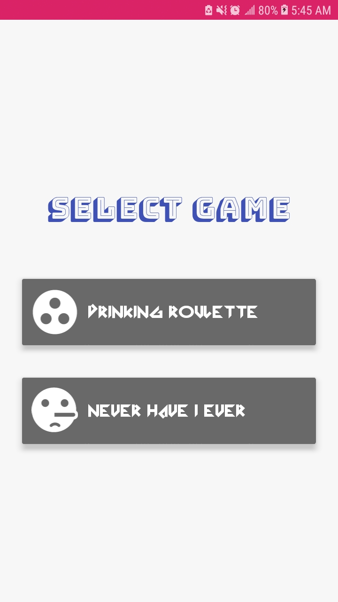
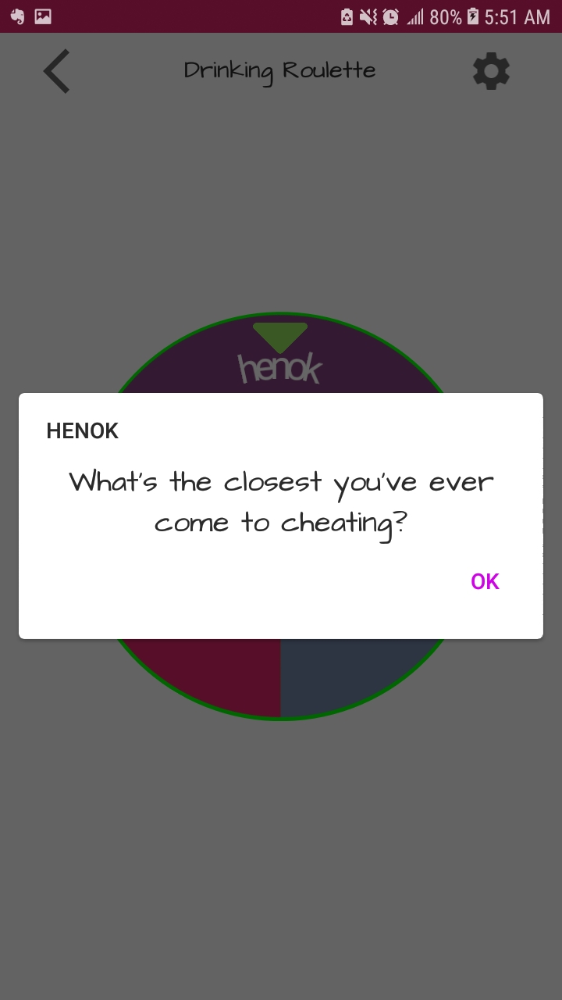

    
    <h2 align="center"> Party Game </h2>
    
 <code> A drinking game is basically a party game with drinking rules. The rules of the game determine when and how much someone has to drink. When you play in a pub, there are sometimes rules for who has to pay for the drinks. </code> 

# Screenshots

<table border="0">
    <tr>
        <td></td>
        <td></td>
        <td></td>
        <td></td>
        <td></td>
        <td></td>
        <td></td>
        <td></td>
    </tr>
</table>

## Two Games [Party Games]

* [X] Drinking Roulette
* [X] Never have I ever

## Supported Languages

* [X] English
* [X] Russian
* [X] Spanish
* [X] Portuguese
* [X] German
* [X] French
* [X] Japanese

Icons made by <a href="https://www.flaticon.com/authors/freepik" title="Freepik">Freepik</a> from <a href="https://www.flaticon.com/" title="Flaticon"> www.flaticon.com</a>
 
Lucky Wheel Library from github <a href="https://github.com/mmoamenn/LuckyWheel_Android" title="LuckyWheel_Android">
Mohamed Mo'men</a> from <a href="https://github.com/mmoamenn" title="mmoamenn"> @mmoamenn</a>
 
